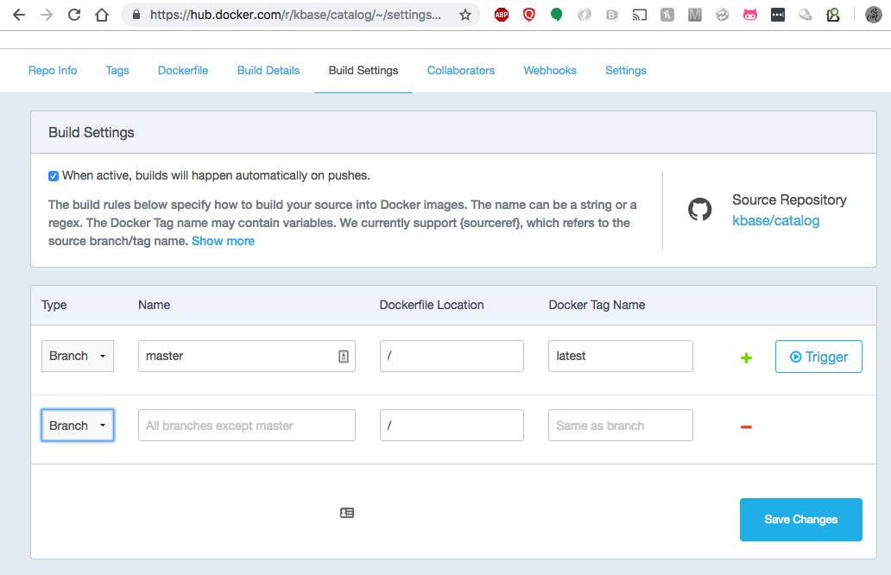
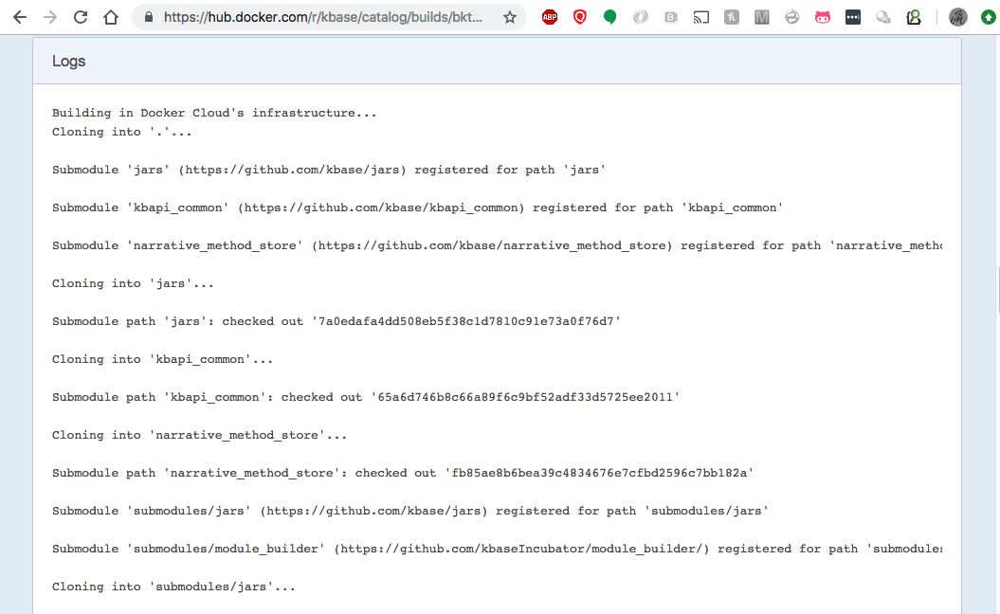
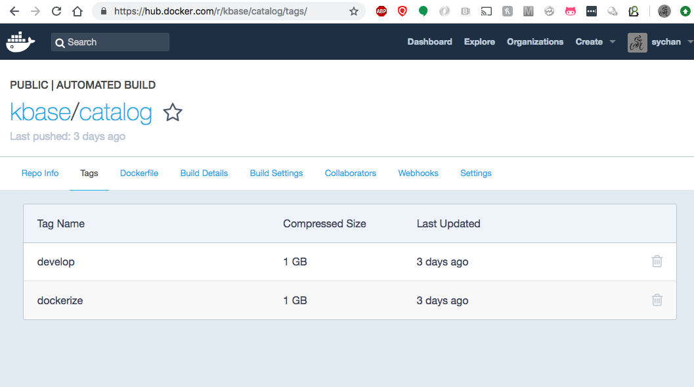

# Setting up Automatic Builds in Dockerhub

Dockerhub is where all KBase core services docker images are kept, as well as widely distributed images such as kb-sdk and sdkbase. In the past we had built images as the final step after travis-ci builds had completed successfully and then pushed the images into dockerhub. This was necessary when the dockerhub build tools were less developed, but required that we keep travis encrypted dockerhub credentials in source code repositories, to authenticate the pushes into dockerhub. Since that time, the dockerhub build tools have matured, and it now makes sense to have builds run entirely in Dockerhub, based on updates to the main branches such as master and develop. This document is provides a resource that should make it easy to enable this for a github repo.

## Steps ##

1. Add a shell script called hooks/build to your repo that is more or less identical to this one: https://github.com/kbase/catalog/blob/develop/hooks/build
1. Make sure that your repo has a Dockerfile at the top level that is completely self-sufficient for building a new image. It is a good idea to use a docker multi-stage build, and build your final code artifacts in a build container, and then copy the code artifacts into a runtime container that is pruned down to only what is necessary for runtime (it should not include a large dev/build toolchain). Here is an example that uses the kbase/sdkbase2 image as a build environment, and then copies the finished code into a smaller python specific runtime image: https://github.com/kbase/catalog/blob/develop/Dockerfile
1. If you have the privileges, go to Dockerhub and create a new automated build from the dashboard, and direct it as the github repo with the hooks/build and Dockerfile from the 2 previous steps. If you don't have the privileges, ask someone with release privs such as Shane Canon, Steve Chan, Keith Keller or Boris Sadhkin to do this. Select the "Create Auto-build Github" option and select the github repo to be built and then fill out the form as necessary.   
  
1. By default, Dockerhub will create new images for every branch of the repo, tagged with the branch name (with the exception of master, which gets tagged "latest"). The "Build Settings" screen can be used to setup builds based on tags, or to have tags or branches tagged with a different value from the branch name.  

1. Once the automated build has been configured, it will be triggered by any pushes to that branch. It can also be triggered manually from the Build Setting page using the "Trigger" button.
1. Builds generally take a few minutes to launch. Their status can be checked on the Build Details tab. The console output from the build can be seen by clicking into the link in the "Status" column and scrolling down to the "Logs" section.  

1. If the build completes successfully, it should result in a new Docker image listed under the Tags tab:  
